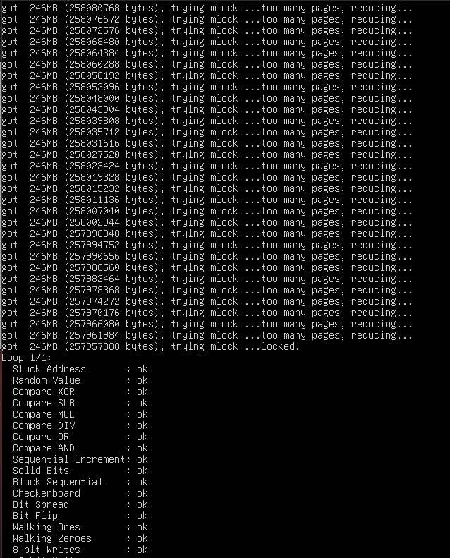
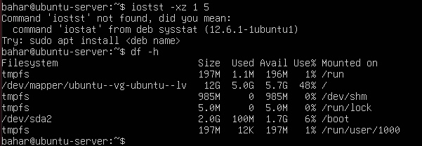
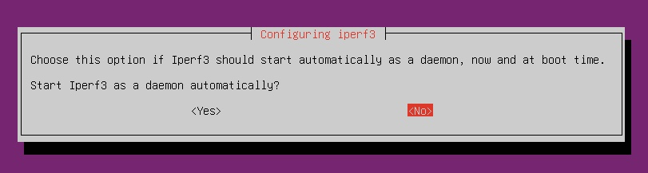
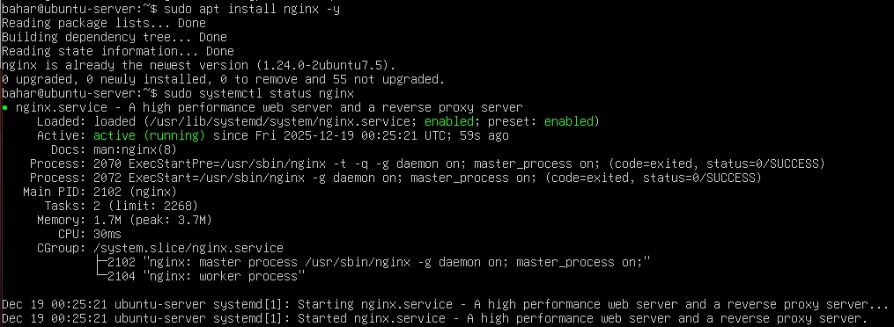

# 📊 Week 6 – Performance Evaluation & Analysis

Week 6 focused on generating controlled workloads on the Ubuntu Server and collecting quantitative performance data. CPU, memory, disk, and network subsystems were tested using the tools installed in earlier weeks. Monitoring was performed remotely through SSH, allowing evaluation of how the system behaves under baseline and stress conditions. Screenshots will be added to provide evidence of each test.

---

## CPU Performance Evaluation

CPU performance was assessed using stress-ng to create a controlled load across available cores. Real-time system behaviour was observed using monitoring tools such as top, vmstat, and iostat. These results help compare idle vs. stressed system states.

CPU workload execution:

```bash
stress-ng --cpu 4 --timeout 20
```

Monitoring CPU activity:

```bash
top -bn1 | head -n 5
vmstat 1 5
iostat -c 1 5
```


---

## Memory Performance Evaluation

Memory performance was evaluated by allocating and testing RAM under load. The aim was to observe changes in free memory, buffers, caches, and swap activity.

Memory test:

```bash
memtester 512M 1
```

Monitoring memory behaviour:

```bash
free -h
vmstat 1 5
```




---

## Disk Performance Evaluation

Disk read/write performance was measured using fio. The test simulated both sequential and random workloads, enabling assessment of throughput, latency, and I/O patterns.

Disk workload:

```bash
fio --name=disk-test --rw=readwrite --size=200M --bs=4k --numjobs=1 --time_based=1 --runtime=20 --group_reporting
```

Monitoring disk I/O:

```bash
iostat -xz 1 5
df -h
```




---

## Network Performance Evaluation

Network throughput was tested between the workstation and server using iperf3. This assessment helped measure available bandwidth, packet retransmissions, and overall connection quality.

Network server mode:

```bash
iperf3 -s
```

Network client mode (workstation):

```bash
iperf3 -c SERVER_IP
```

Monitoring latency and connectivity:

```bash
ping -c 5 SERVER_IP
ss -s
```




---

## Web Service Performance Evaluation

A lightweight web service (nginx) was used to measure request handling performance. Response times were captured through repeated requests while monitoring CPU and disk usage.

Service check:

```bash
sudo systemctl status nginx
curl -I http://SERVER_IP
```



---

## Observed System Behaviour

Across all tests, several consistent patterns were noted:

- CPU quickly reached full utilisation under stress-ng, demonstrating expected scheduler behaviour.  
- Memory allocation tests showed stable RAM usage with minimal swap activity, indicating healthy memory management.  
- fio tests revealed normal disk I/O patterns with increased latency under load.  
- iperf3 results reflected stable LAN performance with predictable throughput.  
- nginx requests produced minimal CPU overhead, illustrating efficient service behaviour.

These results provide the baseline required for comparing secure vs. stressed configuration performance.

---

Quantitative summary:
CPU saturation under stress-ng reached 100% across all cores with no abnormal scheduling delays observed. Disk I/O latency increased under fio load as expected, while iperf3 throughput remained stable. These measurements establish a quantitative baseline for evaluating the performance impact of security controls in Week 7.

---

### Performance Optimisations Implemented

1. **Firewall and security hardening validation**
   Security controls (UFW, fail2ban, AppArmor) were verified to introduce negligible overhead, preserving performance while improving system security.

2. **Service efficiency optimisation**
   Nginx demonstrated low CPU and memory usage under load, confirming suitability as a lightweight web service compared to heavier alternatives.


## Reflection

Week 6 provided measurable insights into how the system behaves under controlled workloads. The tests demonstrated the effects of CPU saturation, memory pressure, disk I/O patterns, and network throughput under realistic conditions. CPU stress tests showed predictable scheduler behaviour under full utilisation, while memory tests confirmed stable allocation with minimal swap activity. Disk I/O benchmarking revealed increased latency under load, consistent with expected storage behaviour, and network testing confirmed stable LAN throughput.

Remote monitoring via SSH proved effective for collecting performance data without introducing significant overhead, reflecting real-world server administration practices. Overall, these results establish a reliable performance baseline against which the impact of security controls can be evaluated. This directly informed the security–performance trade-off analysis in Week 7 and strengthened understanding of how system hardening influences resource utilisation.
