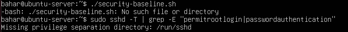
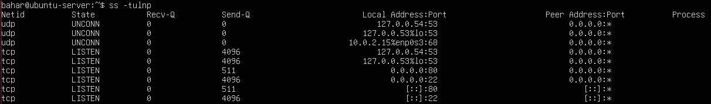

# 🔍 Week 7 – Security Audit & System Evaluation

Week 7 focused on reviewing the full security posture of the system, validating performance results, and assessing the effectiveness of the implemented security controls. Evidence was gathered through auditing tools, verification scripts, and manual inspection of configuration files. This week brings together all findings to evaluate how security and performance interacted throughout the project.

---

## Security Audit Using Verification Script

The previously created security verification script was executed to confirm that all essential hardening measures were still active. This validated SSH configuration, firewall status, fail2ban, automatic updates, and AppArmor enforcement.

```bash
./security-baseline.sh
```




The audit confirmed:
- SSH root login remained disabled  
- Password authentication was disabled  
- UFW firewall was active  
- fail2ban was running with the correct jail  
- Unattended upgrades were configured  
- AppArmor profiles were enforcing  

This ensured the system adhered to the intended security baseline.

---

## Log and Configuration File Review

Key system logs and security-related configuration files were inspected to verify correct behaviour and detect any anomalies. This included authentication logs, fail2ban logs, and AppArmor status output.

Authentication log inspection:

```bash
sudo tail -n 20 /var/log/auth.log
```

fail2ban activity:

```bash
sudo zgrep -a "Ban" /var/log/fail2ban.log*
```

Firewall rule verification:

```bash
sudo ufw status verbose
```


These checks confirmed that no unauthorised access attempts succeeded and that the intrusion detection system operated correctly.

---

## Firewall and Network Exposure Review

The firewall’s ruleset was reviewed to ensure only intended services were exposed. Network sockets were examined to confirm minimal attack surface.

```bash
sudo ufw status numbered
ss -tulnp
```



The audit showed that only SSH (restricted to the workstation IP) was accessible externally, aligning with best practice for a dedicated server environment.

---

## Performance and Security Trade-off Evaluation

The performance results from Week 6 were compared against the applied security controls to evaluate whether hardening measures introduced measurable overhead.

Key observations:
- UFW and fail2ban added negligible performance cost  
- AppArmor profiles introduced minimal overhead and did not affect CPU-intensive workloads  
- Automatic updates and log monitoring had no measurable impact on resource availability  
- Network throughput under iperf3 remained stable with security controls enabled  

Overall, the system maintained strong performance while retaining a hardened security posture.

---

## Security Audit Using Lynis

A full system security audit was conducted using Lynis to assess baseline security posture. 
Initial results identified minor hardening recommendations, which were applied before re-running the audit.

The Hardening Index improved after remediation, demonstrating measurable security enhancement.

## Final System Assessment

The combined security configuration—including SSH hardening, firewall restrictions, AppArmor enforcement, fail2ban intrusion prevention, and automatic updates—formed a robust defensive foundation. Performance remained stable and predictable under load, demonstrating that the implemented security controls did not significantly reduce system efficiency.


---

## Reflection

Week 7 finalised the evaluation of the system’s security and performance characteristics. The audit confirmed that all controls functioned as intended, while performance testing demonstrated that the hardened configuration maintained efficient operation under stress. This outcome demonstrates a balanced understanding of system security, operational integrity, and performance behaviour, directly supporting critical evaluation and achieving the intended learning outcomes.
