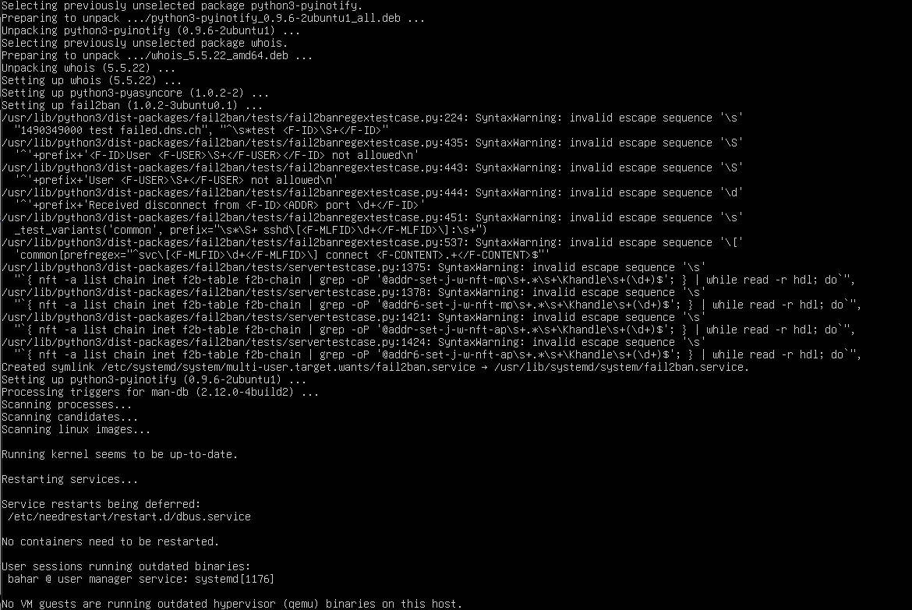
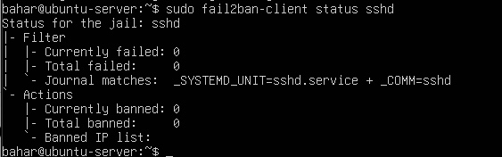

# 🧰 Week 5 – Advanced Security & Monitoring Infrastructure

Week 5 focused on strengthening the system’s security configuration and implementing automated monitoring. The work included applying mandatory access control, enabling automatic updates, configuring intrusion detection, and developing scripts to verify system security and collect performance data. All tasks were completed remotely using SSH from the workstation.

---

## AppArmor: Mandatory Access Control

AppArmor was used to provide application-level confinement, preventing services from performing unauthorised actions even if compromised. After installing the required tools, the status of active profiles was reviewed to confirm that key services were running in enforce mode.

```bash
sudo apt install -y apparmor apparmor-utils
sudo aa-status
```


---

## Automatic Security Updates

Automatic security updates were enabled to reduce exposure to known vulnerabilities. The configuration file and logs were checked to ensure that updates would be applied without manual intervention.

```bash
sudo apt install -y unattended-upgrades
sudo dpkg-reconfigure unattended-upgrades
```

```bash
sudo nano /etc/apt/apt.conf.d/50unattended-upgrades
cat /var/log/unattended-upgrades/unattended-upgrades.log
```


---

## Intrusion Detection with fail2ban

fail2ban was configured to monitor authentication attempts and block repeated failed logins. A local configuration file was created to define SSH-specific rules such as retry limits and ban duration.

```bash
sudo apt install -y fail2ban
sudo cp /etc/fail2ban/jail.conf /etc/fail2ban/jail.local
sudo nano /etc/fail2ban/jail.local
```

Example fail2ban SSH jail:

```ini
[sshd]
enabled  = true
port     = ssh
filter   = sshd
logpath  = /var/log/auth.log
maxretry = 3
bantime  = 600
```

Service verification:

```bash
sudo systemctl restart fail2ban
sudo systemctl status fail2ban
sudo fail2ban-client status sshd
```




---

## Security Verification Script

A verification script was developed to confirm that essential security controls—including SSH configuration, firewall, fail2ban, automatic updates, and AppArmor—remain correctly configured. The script outputs pass/fail messages for each check, supporting ongoing auditing of the system.

```bash
#!/bin/bash
echo "=== Security Baseline Verification ==="

echo "[1] Checking SSH root login..."
if grep -q '^PermitRootLogin no' /etc/ssh/sshd_config; then
  echo "PASS: Root login over SSH is disabled."
else
  echo "FAIL: Root login may still be allowed."
fi

echo
echo "[2] Checking SSH password authentication..."
if grep -q '^PasswordAuthentication no' /etc/ssh/sshd_config; then
  echo "PASS: Password authentication is disabled."
else
  echo "FAIL: Password authentication is still enabled."
fi

echo
echo "[3] Checking firewall status (UFW)..."
if sudo ufw status | grep -q 'Status: active'; then
  echo "PASS: UFW firewall is active."
else
  echo "FAIL: UFW firewall is not active."
fi

echo
echo "[4] Checking fail2ban service..."
if sudo systemctl is-active fail2ban | grep -q 'active'; then
  echo "PASS: fail2ban is running."
else
  echo "FAIL: fail2ban is not running."
fi

echo
echo "[5] Checking unattended upgrades..."
if grep -q 'Unattended-Upgrade' /etc/apt/apt.conf.d/50unattended-upgrades; then
  echo "PASS: Unattended upgrades are configured."
else
  echo "FAIL: Unattended upgrades may not be configured."
fi

echo
echo "[6] Checking AppArmor enforcement..."
if sudo aa-status | grep -q 'profiles are in enforce mode'; then
  echo "PASS: AppArmor profiles are enforcing."
else
  echo "WARN: AppArmor may not be fully enforcing."
fi

echo
echo "=== Verification Complete ==="
```


---

## Remote Monitoring Script

A remote monitoring script was created to gather performance metrics via SSH. It collects CPU usage, memory information, disk statistics, and network activity, preparing the system for performance analysis in Week 6.

```bash
#!/bin/bash

SERVER_USER="adminuser"
SERVER_IP="SERVER_IP_HERE"

echo "=== Remote Server Monitoring ==="
echo "Target: ${SERVER_USER}@${SERVER_IP}"
echo

ssh "${SERVER_USER}@${SERVER_IP}" bash << 'EOF'
echo "-- CPU & Memory Snapshot --"
top -bn1 | head -n 5
echo

echo "-- Memory Overview --"
free -h
echo

echo "-- Disk Usage --"
df -h
echo

echo "-- I/O Statistics --"
iostat -xz 1 3
echo

echo "-- Network Sockets Summary --"
ss -s
EOF

echo
echo "=== Monitoring Completed ==="
```


---

## Reflection

Week 5 significantly improved the server’s security and monitoring capabilities. AppArmor added strong application confinement, unattended-upgrades ensured timely patching, and fail2ban provided active intrusion prevention. The verification and monitoring scripts enabled structured auditing and prepared the system for quantitative performance analysis in Week 6. These activities demonstrate effective security implementation, strong command-line proficiency, and a clear foundation for evaluating security and performance trade-offs.
